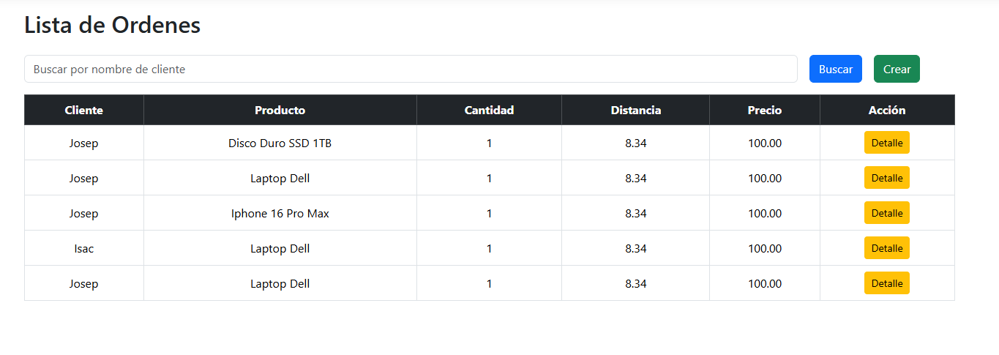
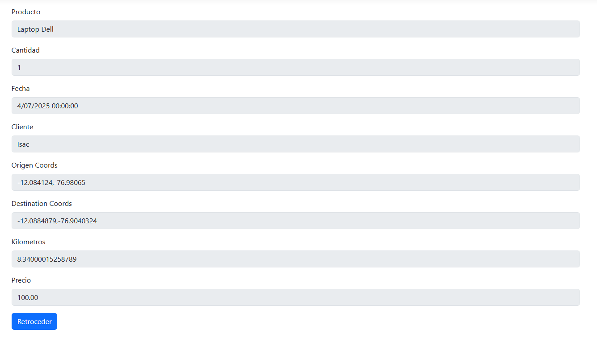
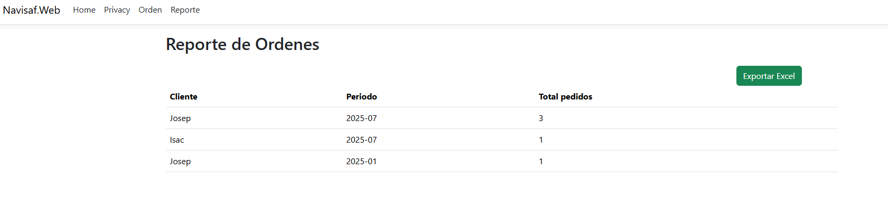
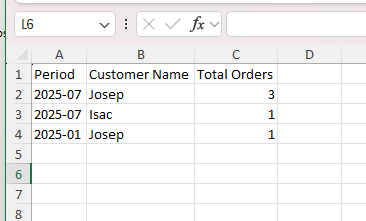

# 🧭 Navisaf

Una empresa de logística necesita un sistema para registrar órdenes de despacho. Cada orden tiene un
origen y un destino, definidos por coordenadas geográficas (latitud y longitud). El sistema debe:
* Permitir crear una orden indicando cliente, producto, cantidad, origen y destino.
* Calcular la distancia entre el punto de origen y destino usando (Se sugiere la fórmula de Haversine).
* Calcular un costo estimado del despacho basado en la distancia de la siguiente manera:
  - Si la distancia entre los puntos está entre 1 a 50 kilómetros, el costo es de 100 USD.
  - Si la distancia entre los puntos está entre 51 a 200 kilómetros, el costo es de 300 USD.
  - Si la distancia entre los puntos está entre 201 a 500 kilómetros, el costo es de 1000 USD.
  - Si la distancia entre los puntos está entre 500 a 1000 kilómetros, el costo es de 1500 USD.
  - No se permite crear órdenes con distancias mayores a 1000 kilómetros.
  - No se permite crear órdenes con distancias menores a 1 kilómetro.
- Almacenar la orden en una base de datos.
- Al consultar una orden debe aparece la información de cliente, producto, coordenadas de origen,
destino y la distancia calculada.
- Permitir consultar en la web las órdenes por cliente.
- Permitir consultar en la web un reporte que muestre, por cada cliente, la cantidad de órdenes que
existen por cada intervalo. Este reporte, aparte de su visualizacion, debe permitir su descarga en un
archivo de excel

---
## 🛠 Requisitos
- [.NET 9 SDK](https://dotnet.microsoft.com/en-us/download)
- Visual Studio 2022+ o VS Code con la extensión de C#

## 🚀 Cómo levantar el proyecto

1. **Clona el repositorio o descarga el código fuente.**

2. **Abre la solución:**

   ```
   PruebaTecnica-JosepFuentes.sln
   ```
3. **Configura la cadena de conexión a la base de datos:**
4. En el archivo `appsettings.json`, actualiza la sección `ConnectionStrings` con tu cadena de conexión a la base de datos SQL Server.

   ```json
   "ConnectionStrings": {
       "DefaultConnection": "Server=tu_servidor;Database=tu_base_de_datos;User Id=tu_usuario;Password=tu_contraseña;"
   }
   ```
5. **Restaura los paquetes NuGet:**
   ```plaintext
   En Visual Studio, haz clic derecho en la solución y selecciona "Restaurar paquetes NuGet".
   ```
6. **Ejecuta las migraciones:**
7. Abre la Consola del Administrador de Paquetes y ejecuta el siguiente comando para aplicar las migraciones a la base de datos:

   ```
   dotnet ef database update
   ```
8. **Inicia la aplicación:**
    ``` plaintext
   En Visual Studio, selecciona el proyecto `Navisaf.Web` como proyecto de inicio y haz clic en "Iniciar" o presiona `F5`.
    ```

## 🧩 Arquitectura

El proyecto sigue una estructura limpia basada en capas:

```plaintext

src/
├── Navisaf.Application # Capa de lógica de negocio y reglas (MediatR, FluentValidation, Pipelines)
├── Navisaf.Infrastructure # Capa de infraestructura (persistencia, servicios externos)
├── Navisaf.Domain # Capa de dominio (entidades)
├── Navisaf.Web # API principal (endpoints, configuración)
```

## ✅ Cómo ejecutar las pruebas unitarias

Este proyecto incluye pruebas unitarias utilizando **xUnit**, **FluentAssertions**, **Bogus** y **EF Core InMemory**.

### 🔧 Pasos para ejecutar las pruebas

1. Abre una terminal en la raíz del proyecto (donde está la solución `.sln`):
2. Ejecuta las pruebas con el siguiente comando:
    ```bash
    dotnet test
    ```




